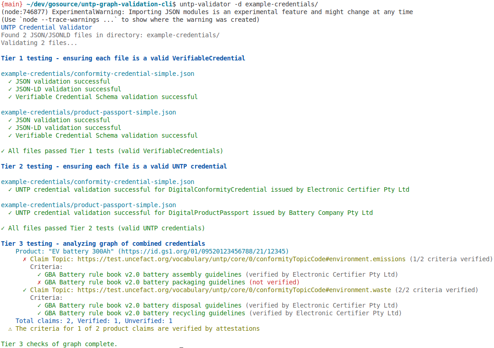

# UNTP Credential Validator

A command-line tool and library for validating UN Trade Platform (UNTP) verifiable credentials.

Example output:



## Features

- **Tier 1 Validation**: Ensures each file is a valid JSON linked data and conforms to the W3C Verifiable Credential schema.
- **Tier 2 Validation**: Determines the UNTP credential type and validates credentials against the UNTP-specific schemas, including required fields.
- **Tier 3 Validation**: Creates a graph from the provided credentials and analyzes the relationships between credentials using graph validation, as a proof-of-concept, using [notation3](https://w3c.github.io/N3/spec/), and currently supporting:
  - Verification of the criteria of product claims against conformity attestations
  - Saving the graph locally to ease the development of further N3 queries using semantic reasoning on the command-line.

## Installation

As a proof-of-concept, this CLI is currently only available by cloning the
git repository, where you'll have some example data to try the tool.

```bash
# Clone the repository
git clone https://github.com/absoludity/untp-graph-validation-cli.git
cd untp-graph-validation-cli

# Install dependencies
npm install

# Build the project
npm run build
```

## Usage

### Command Line

See the image above for example output.

```bash
# Validate all credentials in a directory
npm run validate -- -d example-credentials/

# Validate a single credential file
npm run validate -- example-credentials/product-passport-simple.json

# Show detailed validation information
npm run validate -- -v example-credentials/product-passport-simple.json

# Save the RDF graph to a file for further analysis
npm run validate -- --save-graph example-credentials/product-passport-simple.json
```

## Notation3 Queries

The Tier 3 validation uses N3 queries to analyze relationships between credentials within the graph.

The simplest of the UNTP N3 queries is [list-all-product-claim-criteria.n3](src/core/queries/list-all-product-claim-criteria.n3) which finds all product claims from DigitalProductPassports and includes the criteria, without doing any relationship analysis.

The second query, [list-verified-product-claim-criteria.n3](src/core/queries/list-verified-product-claim-criteria.n3) begins similarly but adds the condition that the graph includes an attestation for each criterion from a DigitalConformityCertificate.


## Developing and Testing further N3 Queries

The queries themselves can be copied, modified and tested to create examples of further tier 3 tests without needing to write any code for the UNTP validator itself.

Once a new query is tested, stable and demonstrates the required validation, the UNTP validator CLI tool can then be updated to include the new query in its tests and present the results appropriately.

This section explains how to develop and test new N3 queries for the UNTP credential validation tool. The tool uses the [EYE reasoner for JS](https://github.com/eyereasoner/eye-js) to execute N3 queries against graphs generated from UNTP credentials.

### Generating a graph

First we need some graph data to work with. To generate an RDF graph from the example credentials, use the `--save-graph` option:

```bash
npm run validate -- --dir example-credentials --save-graph
```

This will create a file named `credential-graph.n3` in the current directory containing all the RDF triples from your credentials.

### Testing Queries with EYE Reasoner

Once you have an RDF graph, you can test a query directly using the [EYE reasoner CLI](https://github.com/eyereasoner/eye-js), which is already installed with the UNTP graph validation CLI, and can be used to run a query directly with, for example:

```bash
npm run query -- credential-graph.n3  src/core/queries/list-all-product-claim-criteria.n3
```

NOTE: This currently fails due to an issue which I've fixed upstream but am waiting for the fix to land and be released. See https://github.com/eyereasoner/eye-js/issues/1585 .

This will execute the query and display human-readable output using the `log:outputString` statements in the query.

Example output:
```
EV battery 300Ah | <https://id.gs1.org/01/09520123456788/21/12345> | <https://test.uncefact.org/vocabulary/untp/core/0/conformityTopicCode#environment.emissions> | <https://www.globalbattery.org/media/publications/gba-rulebook-v2.0-master.pdf#BatteryAssembly>.

EV battery 300Ah | <https://id.gs1.org/01/09520123456788/21/12345> | <https://test.uncefact.org/vocabulary/untp/core/0/conformityTopicCode#environment.emissions> | <https://www.globalbattery.org/media/publications/gba-rulebook-v2.0-master.pdf#BatteryPackaging>.

EV battery 300Ah | <https://id.gs1.org/01/09520123456788/21/12345> | <https://test.uncefact.org/vocabulary/untp/core/0/conformityTopicCode#environment.waste> | <https://www.globalbattery.org/media/publications/gba-rulebook-v2.0-master.pdf#BatteryDisposal>.

EV battery 300Ah | <https://id.gs1.org/01/09520123456788/21/12345> | <https://test.uncefact.org/vocabulary/untp/core/0/conformityTopicCode#environment.waste> | <https://www.globalbattery.org/media/publications/gba-rulebook-v2.0-master.pdf#BatteryRecycling>.
```

Or to query for claim criteria that has been attested as conformant:

```bash
$ npm run query -- credential-graph.n3  src/core/queries/list-verified-product-claim-criteria.n3

> untp-graph-validation-cli@0.1.0 query
> eyereasoner --nope --quiet --strings credential-graph.n3 src/core/queries/list-verified-product-claim-criteria.n3


EV battery 300Ah | <https://id.gs1.org/01/09520123456788/21/12345> | <https://test.uncefact.org/vocabulary/untp/core/0/conformityTopicCode#environment.emissions> | <https://www.globalbattery.org/media/publications/gba-rulebook-v2.0-master.pdf#BatteryAssembly> | Electronic Certifier Pty Ltd.

EV battery 300Ah | <https://id.gs1.org/01/09520123456788/21/12345> | <https://test.uncefact.org/vocabulary/untp/core/0/conformityTopicCode#environment.waste> | <https://www.globalbattery.org/media/publications/gba-rulebook-v2.0-master.pdf#BatteryDisposal> | Electronic Certifier Pty Ltd.

EV battery 300Ah | <https://id.gs1.org/01/09520123456788/21/12345> | <https://test.uncefact.org/vocabulary/untp/core/0/conformityTopicCode#environment.waste> | <https://www.globalbattery.org/media/publications/gba-rulebook-v2.0-master.pdf#BatteryRecycling> | Electronic Certifier Pty Ltd.
```

### Adding New Queries

To add a new query:

1. Create a new `.n3` file in the `src/core/queries` directory
2. Follow the query structure above, providing both human-readable output and RDF triples
3. Test your query using the EYE reasoner CLI and example graph data
4. Ask for the UNTP graph validation tool itself to be updated to present the new query and its results in the Tier 3 testing (see TODO below).

### Debugging Queries

There is a VisualStudio plugin for [N3 Language and Reasoning Support](https://marketplace.visualstudio.com/items?itemName=w3cn3.n3-lang-exec) which can be installed in the usual way. It has auto-completion, syntax highlighting and debugging (though via the main eye reasoner, not the JS version - see TODO).

This may help with writing new queries, but the best advice is the obvious start small and simple and build incrementally. You can also update the call to `eyereasoner` to:

- Omit the `--quiet` option to see more detailed output from the reasoner
- Use the `--pass-all` option to see all triples, including input triples
- Use the `--debug` option for even more detailed debugging information

For more options, see the [EYE reasoner documentation](https://github.com/eyereasoner/eye).

## Architecture

The UNTP Credential Validator is designed with a clear separation of concerns and a focus on extensibility. Here's an overview of the key architectural decisions:

### Technology Stack

- **Node.js with TypeScript**: Chosen for consistency with other UNTP libraries (such as [UNTP Test Suite](https://github.com/uncefact/tests-untp)) so that developers familiar with the UNTP ecosystem can understand and contribute to this tool.

- **Notation3 (N3)**: Selected as the semantic reasoning engine after evaluating several alternatives. N3 offers several advantages for graph validation:
   - queries that are themselves written in a small superset of RDF/Turtle which also includes declarative programming concepts,
   - allows expressing provenance of particular data (though I still have a TODO to import the credentials into separate named graphs),
   - supports pulling in additional linked data from the web when referred to by nodes.
  - Active development and community support, whilst still being a longer-term project by a well-known technologist (the original spec is from 2008 written by non other than Tim Berners-Lee and Dan Connolly)
  - inference capabilities for trust relationships
  - See the [N3 Spec Introduction](https://w3c.github.io/N3/spec/#introduction) for more information about N3.


### Core Architecture Principles

- **Tiered Validation Approach**: The validation process is clearly separated into the three tiers specified by the UNTP project (see Features above), both in the UX and code library.

- **Separation of Core and CLI**:
  - The `core` module contains all graph validation logic and aims to be UI-agnostic, returning structured data for use by a UI, such as the `cli` module.
  - The `cli` module provides the command-line interface and formatting
  - This separation allows the core validation logic to be reused in other contexts (e.g., web applications, APIs)

- **Modular Query System**:
  - N3 queries are stored as separate files in the `src/core/queries` directory
  - Queries can be developed and tested independently of the application code
  - New validation queries can be developed and tested without needing to touch the code until the query is ready to be integrated into the UX, potentially allowing different authors for queries vs code, but also allowing the queries to be used from other languages in the future.

- **Extensible Result Format**:
  - The `ValidationResult` interface tries to provide a consistent structure for validation results (TODO: extend this to the core's tier3Validators, added TODO below)
  - Results include detailed error and warning information with codes and messages
  - Metadata can be attached to results for additional context

### Query Structure

So that queries can be both run and developed iteratively directly, while also being able to be used as the source of data within the UNTP graph validation CLI, queries should be structured to produce both:

1. **Human-readable output** using `log:outputString` for easy iterating and use from eyereasoner, and
2. **RDF triples** for programmatic use by the validation tool

as is the case for the two queries demonstrated above.

When the query is run from within the UNTP graph validation CLI, the string output is filtered out and only the RDF triples are used. When the query is run via `npm run query` you may note that the `--strings` option is passed to eyereasoner which ensures only strings are returned (not triplets).

The eyereasoner tool (and lib) has an option to only emit new data, which is why the example queries use the `result:` prefix for the predicate, so that only those new (and relevant) triples are returned by the query (this may be an anti-pattern that we want to change, since we could instead be adding inferences as new data to the existing graph to build logic over multiple queries - see TODO below.)

## Requirements

- Node.js 16 or higher
- EYE reasoner (for advanced graph validation)

## License

See [LICENSE](./LICENSE)

## TODO

I don't currently have a (non-personal) repo for this yet, so rather than creating issues, I'll just list here the current TODOs:

- Update README once my [upstream eyereasoner fix lands](https://github.com/eyereasoner/eye-js/pull/1586).
- Update to verify and unpack enveloped credentials (current examples aren't enveloped just for a quick path to testing the architecture).
- Try again to convert to using named graphs rather than a single default graph, to retain provenance in the actual data.
- Develop a query that highlights or extracts a trust graph of VC's (ie. all VC's with links back to digital identity anchors) for visualisation.
- Investigate whether we should not return just new data, but add inferences as each query runs to the existing data, building logic over multiple queries, such as checking DIAs for a DCC issuer that attests to certain criteria.
- Develop and test a query that allows pulling in linked data via the  `log:semantics` built-in predicate.
- Investigate further whether there's a more "drop-in" way to include new queries. The main issue is that to present results, the query result needs to be parsed into relevant structs by the core library, and returned to the CLI (or web) interface.
- Check whether the VSCode plugin's support for debugging can be used with the eye-js reasoner which is already installed with the repo.
- Update the tier3Validators to use the `ValidationResult` consistently with other core tiers.
