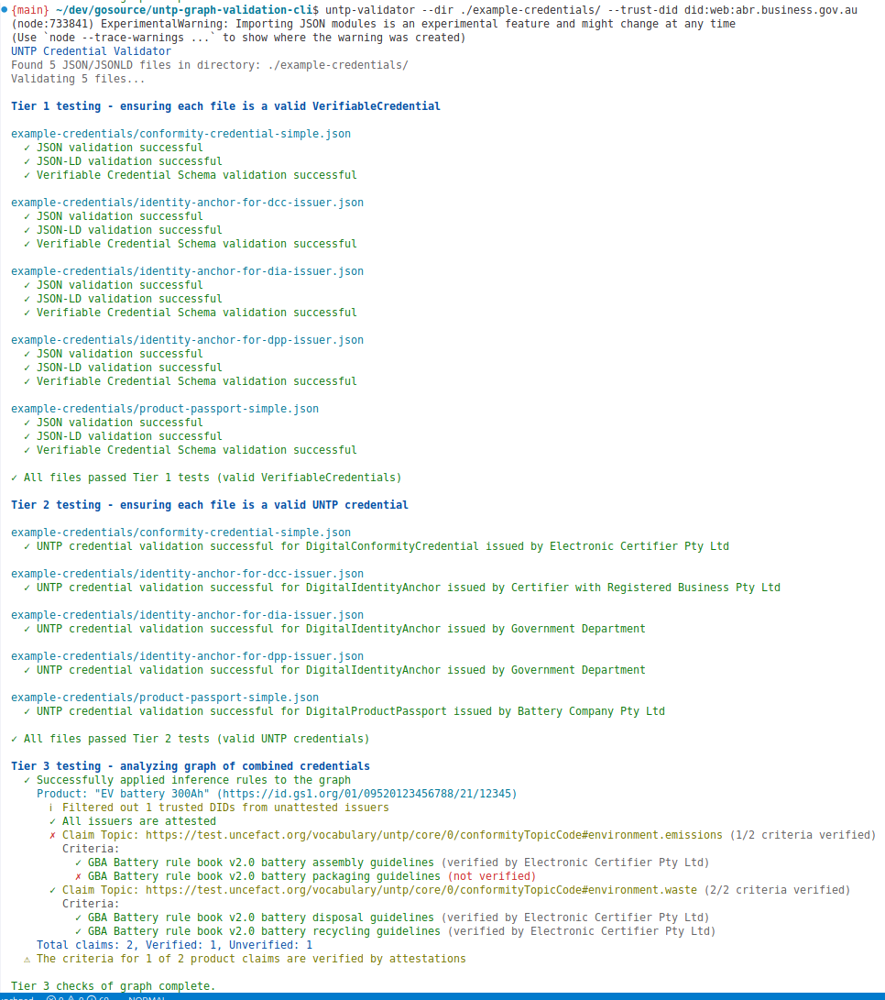

# UNTP Credential Validator

A command-line tool and library for validating UN Trade Platform (UNTP) verifiable credentials.

Example output:



## Features

- **Tier 1 Validation**: Ensures each file is a valid JSON linked data and conforms to the W3C Verifiable Credential schema.
- **Tier 2 Validation**: Determines the UNTP credential type and validates credentials against the UNTP-specific schemas, including required fields.
- **Tier 3 Validation**: Creates a graph from the provided credentials and runs inferences on the data, before querying for the relevant data, using
  - [notation3](https://w3c.github.io/N3/spec/), and
  - SPARQL for querying the relevant data.
The tier 3 validation currently supports:
  - Verification of the criteria of product claims against conformity attestations
  - Saving the graph locally to ease the development of further N3 inference rules and SPARQL queries.

## Installation

As a proof-of-concept, this CLI is currently only available by cloning the
git repository, where you'll have some example data to try the tool.

```bash
# Clone the repository
git clone https://github.com/absoludity/untp-graph-validation-cli.git
cd untp-graph-validation-cli

# Install dependencies
npm install

# Build the project
npm run build
```

## Usage

### Command Line

See the image above for example output.

```bash
# Validate all credentials in a directory
npm run validate -- -d example-credentials/

# Validate a single credential file
npm run validate -- example-credentials/product-passport-simple.json

# Show detailed validation information
npm run validate -- -v example-credentials/product-passport-simple.json

# Save the RDF graph to a file for further analysis
npm run validate -- --save-graph example-credentials/product-passport-simple.json
```

## Notation3 Inference Rules and SPARQL Queries

The Tier 3 validation uses a two-step process:

1. **Inference Rules**: N3 rules in the `src/core/inferences` directory are applied to the graph in numerical order to derive new relationships and facts. These rules follow a naming convention with numeric prefixes (e.g., `10-infer-product-claim-criteria-verified.n3`) to ensure they're executed in the correct sequence.
2. **SPARQL Queries**: After inferences are applied, SPARQL queries extract structured data from the enriched graph.

### Inference Rules

- `10-infer-product-claim-criteria-verified.n3`: Identifies criteria in product claims that are verified by conformity credentials
- `20-infer-product-claim-verified.n3`: Determines if all criteria for a claim are verified, marking the entire claim as verified

The SPARQL queries within the code (currently) are then used to query the relevant data for presentation.

## Developing and Testing Inference Rules

The inference rules can be developed and tested independently of the application code.

This section explains how to develop and test new N3 inferences for the UNTP credential validation tool. The tool uses the [EYE reasoner for JS](https://github.com/eyereasoner/eye-js) to execute N3 queries against graphs generated from UNTP credentials.

### Generating a graph

First we need some graph data to work with. To generate an RDF graph from the example credentials, use the `--save-graph` option:

```bash
npm run validate -- --dir example-credentials --save-graph
```

This will create a file named `credential-graph.n3` in the current directory containing all the RDF triples from your credentials.

### Testing inferences with EYE Reasoner

Once you have an RDF graph, you can test an inference rule directly using the [EYE reasoner CLI](https://github.com/eyereasoner/eye-js), which is already installed with the UNTP graph validation CLI, and can be used to run a query directly with, for example:

```bash
$ npm run query -- credential-graph.n3 src/core/inferences/10-infer-product-claim-criteria-verified.n3
```

This will execute the inference rule and display only the new triples derived from the rule (thanks to the `--pass-only-new` option).

Example output:
```
<example:product:1:claim:1> result:verifiedCriterion <https://www.globalbattery.org/media/publications/gba-rulebook-v2.0-master.pdf#BatteryAssembly>.
<example:product:1:claim:1> result:dependsOn <http://localhost/credentials/untp-dcc-simple.json>.
<http://localhost/credentials/untp-dpp-simple.json> result:claimsAttestedBy <http://localhost/credentials/untp-dcc-simple.json>.
<example:product:1:claim:2> result:verifiedCriterion <https://www.globalbattery.org/media/publications/gba-rulebook-v2.0-master.pdf#BatteryDisposal>.
<example:product:1:claim:2> result:dependsOn <http://localhost/credentials/untp-dcc-simple.json>.
<example:product:1:claim:2> result:verifiedCriterion <https://www.globalbattery.org/media/publications/gba-rulebook-v2.0-master.pdf#BatteryRecycling>.
```

Or to infer which claims have been fully verified (note, this depends on the inferences from the above rule as well, hence including both in order):

```bash
$ npm run query -- credential-graph.n3 src/core/inferences/10-infer-product-claim-criteria-verified.n3 src/core/inferences/20-infer-product-claim-verified.n3

> untp-graph-validation-cli@0.1.0 query
> eyereasoner --nope --quiet --pass-only-new credential-graph.n3 src/core/inferences/10-infer-product-claim-criteria-verified.n3 src/core/inferences/20-infer-product-claim-verified.n3

@prefix result: <http://example.org/result#>.

<example:product:1:claim:1> result:verifiedCriterion <https://www.globalbattery.org/media/publications/gba-rulebook-v2.0-master.pdf#BatteryAssembly>.
<example:product:1:claim:1> result:dependsOn <http://localhost/credentials/untp-dcc-simple.json>.
<http://localhost/credentials/untp-dpp-simple.json> result:claimsAttestedBy <http://localhost/credentials/untp-dcc-simple.json>.
<example:product:1:claim:2> result:verifiedCriterion <https://www.globalbattery.org/media/publications/gba-rulebook-v2.0-master.pdf#BatteryDisposal>.
<example:product:1:claim:2> result:dependsOn <http://localhost/credentials/untp-dcc-simple.json>.
<example:product:1:claim:2> result:verifiedCriterion <https://www.globalbattery.org/media/publications/gba-rulebook-v2.0-master.pdf#BatteryRecycling>.
<example:product:1:claim:2> result:allCriteriaVerified true.
```

where the last triplet has inferred that the second claim of the product:1 has all criteria verified.

### Adding New Inference Rules

To add a new inference rule:

1. Create a new `.n3` file in the `src/core/inferences` directory
2. Use a numeric prefix to indicate the order of execution (e.g., `30-infer-something-new.n3`)
3. Test your rule using the EYE reasoner and example graph data
4. The rule will automatically be included in the validation process based on its filename

### Debugging Notation3 rules

There is a VisualStudio plugin for [N3 Language and Reasoning Support](https://marketplace.visualstudio.com/items?itemName=w3cn3.n3-lang-exec) which can be installed in the usual way. It has auto-completion, syntax highlighting and debugging (though via the main eye reasoner, not the JS version - see TODO).

This may help with writing new queries, but the best advice is the obvious start small and simple and build incrementally. You can also update the call to `eyereasoner` to:

- Omit the `--quiet` option to see more detailed output from the reasoner
- Use the `--pass-all` option to see all triples, including input triples
- Use the `--debug` option for even more detailed debugging information

For more options, see the [EYE reasoner documentation](https://github.com/eyereasoner/eye).

## Architecture

The UNTP Credential Validator is designed with a clear separation of concerns and a focus on extensibility. Here's an overview of the key architectural decisions:

### Technology Stack

- **Node.js with TypeScript**: Chosen for consistency with other UNTP libraries (such as [UNTP Test Suite](https://github.com/uncefact/tests-untp)) so that developers familiar with the UNTP ecosystem can understand and contribute to this tool.

- **Notation3 (N3)**: Selected as the semantic reasoning engine after evaluating several alternatives. N3 offers several advantages for graph validation:
   - queries and inference rules that are themselves written in a small superset of RDF/Turtle which also includes declarative programming concepts,
   - allows expressing provenance of particular data (though I still have a TODO to import the credentials into separate named graphs),
   - supports pulling in additional linked data from the web when referred to by nodes.
  - Active development and community support, whilst still being a longer-term project by a well-known technologist (the original spec is from 2008 written by non other than Tim Berners-Lee and Dan Connolly)
  - inference capabilities for trust relationships
  - See the [N3 Spec Introduction](https://w3c.github.io/N3/spec/#introduction) for more information about N3.


### Core Architecture Principles

- **Tiered Validation Approach**: The validation process is clearly separated into the three tiers specified by the UNTP project (see Features above), both in the UX and code library.

- **Separation of Core and CLI**:
  - The `core` module contains all graph validation logic and aims to be UI-agnostic, returning structured data for use by a UI, such as the `cli` module.
  - The `cli` module provides the command-line interface and formatting
  - This separation allows the core validation logic to be reused in other contexts (e.g., web applications, APIs)

- **Modular Query System**:
  - N3 inference rules are stored as separate files in the `src/core/inferences` directory
  - New queries and inference rules can be developed and tested without needing to touch the code until the query is ready to be integrated into the UX, potentially allowing different authors for queries vs code, but also allowing the queries to be used from other languages in the future.

- **Extensible Result Format**:
  - The `ValidationResult` interface tries to provide a consistent structure for validation results (TODO: extend this to the core's tier3Validators, added TODO below)
  - Results include detailed error and warning information with codes and messages
  - Metadata can be attached to results for additional context

## Requirements

- Node.js 16 or higher
- EYE reasoner (for advanced graph validation)

## License

See [LICENSE](./LICENSE)

## TODO

I don't currently have a (non-personal) repo for this yet, so rather than creating issues, I'll just list here the current TODOs:

- Update to verify and unpack enveloped credentials (current examples aren't enveloped just for a quick path to testing the architecture).
- Try again to convert to using named graphs rather than a single default graph, to retain provenance in the actual data.
- NEXT: Develop a query that highlights or extracts a trust graph of VC's (ie. all VC's with links back to digital identity anchors) for visualisation.
- DONE: Investigate whether we should not return just new data, but add inferences as each query runs to the existing data, building logic over multiple queries, such as checking DIAs for a DCC issuer that attests to certain criteria. Possibly this could be tested via eyereasoner by piping results, or running multiple queries? Check.
- Develop and test a query that allows pulling in linked data via the  `log:semantics` built-in predicate., maybe pulling in a DIA.
- Pulling in SVC data for human readable explanations on the output visualisation.
- Investigate further whether there's a more "drop-in" way to include new inferences. The main issue is that to present results, the query result needs to be parsed into relevant structs by the core library, and returned to the CLI (or web) interface. (Chris's example of policy violations)
- Check whether the VSCode plugin's support for debugging can be used with the eye-js reasoner which is already installed with the repo.
- Update the tier3Validators to use the `ValidationResult` consistently with other core tiers.
- Ensure that credentials are within their validity dates to be considered.
- Could we use backward chaining (which n3 supports) - how could this be useful with lots of data?
